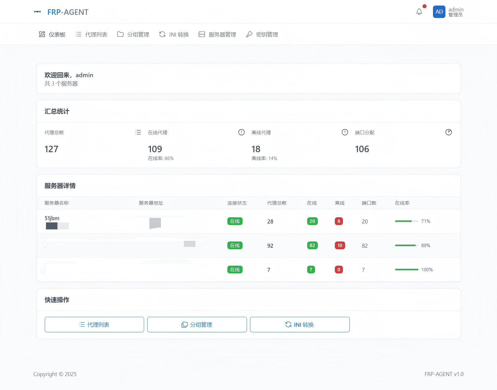

# frp-agent 管理系统

一个简单易用的 frp 代理管理系统，通过 Web 界面轻松管理多个 frp 服务器和代理配置。



## 功能特性

- **多服务器管理** - 统一管理多个 frp 服务器，实时查看连接状态
- **代理管理** - 创建、编辑、删除代理配置，支持批量操作
- **端口管理** - 自动分配端口，智能检测端口冲突
- **状态监控** - 实时显示代理在线/离线状态，统计在线率
- **配置生成** - 一键生成标准的 frpc 配置文件（支持 INI/TOML 格式）
- **配置导入** - 支持导入现有配置文件，快速迁移
- **分组管理** - 对代理进行分组管理，支持自动分析分组
- **格式转换** - INI 和 TOML 格式互转，方便配置迁移

## 快速开始

### 快捷启动（推荐）

使用已打包好的镜像，一条命令即可启动：

```bash
docker run -d \
  --name frp-agent \
  -p 8000:8000 \
  -v $(pwd)/data:/app/data \
  registry.cn-shanghai.aliyuncs.com/numen/frp-agent:latest
```

启动后访问 http://localhost 进入管理界面。

### Docker Compose 部署

```bash
# 1. 克隆项目
git clone <repository-url>
cd frp-agent

# 2. 创建数据目录
mkdir -p data

# 3. 启动服务
docker-compose up -d

# 4. 查看日志
docker-compose logs -f
```

启动后访问 http://localhost 进入管理界面。

### 本地部署

#### 启动后端

```bash
# 1. 进入后端目录
cd backend

# 2. 安装依赖
pip install -r requirements.txt

# 3. 启动服务
python app.py
```

后端服务将在 http://localhost:8000 启动。

#### 启动前端

```bash
# 1. 进入前端目录
cd frontend

# 2. 安装依赖
npm install

# 3. 启动开发服务器
npm run dev
```

前端开发服务器将在 http://localhost:5173 启动。

## 主要功能

### 仪表板

- 查看所有服务器的汇总统计
- 实时监控代理在线状态
- 快速访问常用功能

### 服务器管理

- 添加、编辑、删除 frp 服务器
- 测试服务器连接状态
- 查看服务器详细信息

### 代理管理

- 创建和管理代理配置
- 批量操作代理
- 查看代理状态和端口使用情况

### 配置导入

支持通过命令行快速导入配置：

```bash
# 导入 INI 配置
curl -u admin:admin -X POST \
  -H "Content-Type: text/plain" \
  --data-binary "@frpc.ini" \
  http://localhost:8000/api/config/import/ini/服务器名

# 导入 TOML 配置
curl -u admin:admin -X POST \
  -H "Content-Type: text/plain" \
  --data-binary "@frpc.toml" \
  http://localhost:8000/api/config/import/toml/服务器名
```

查看所有服务器名称：

```bash
curl -u admin:admin http://localhost:8000/api/servers | jq '.[].name'
```

## 默认账号

- **用户名**：`admin`
- **密码**：`admin`

首次登录后建议修改密码。

## 许可证

MIT License
