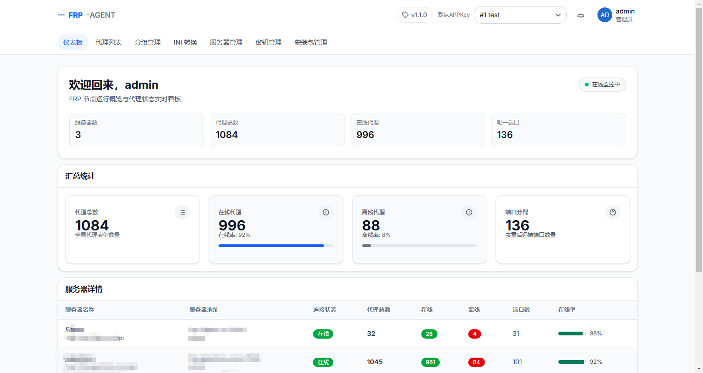
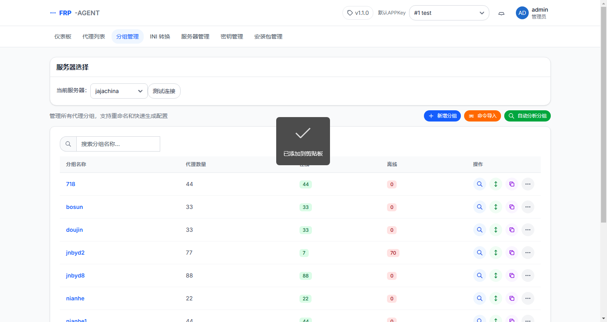
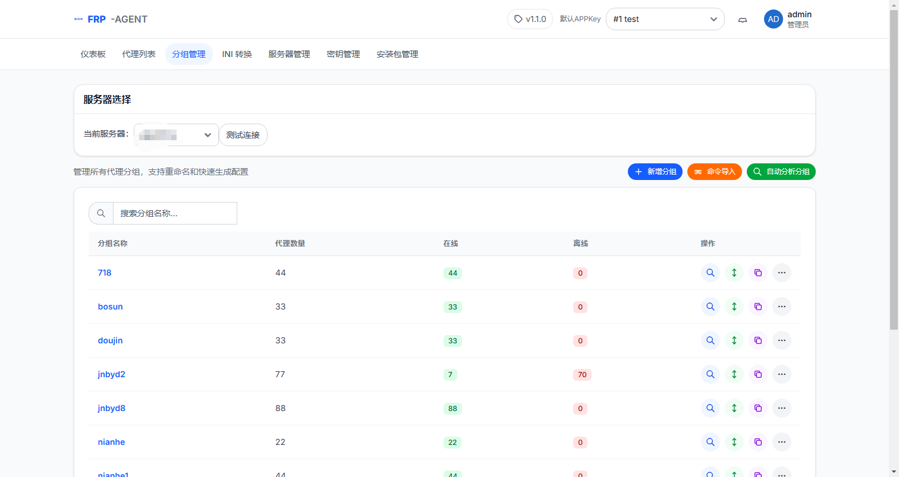
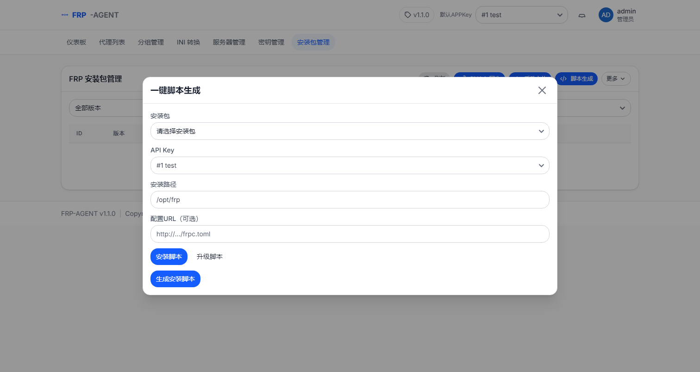
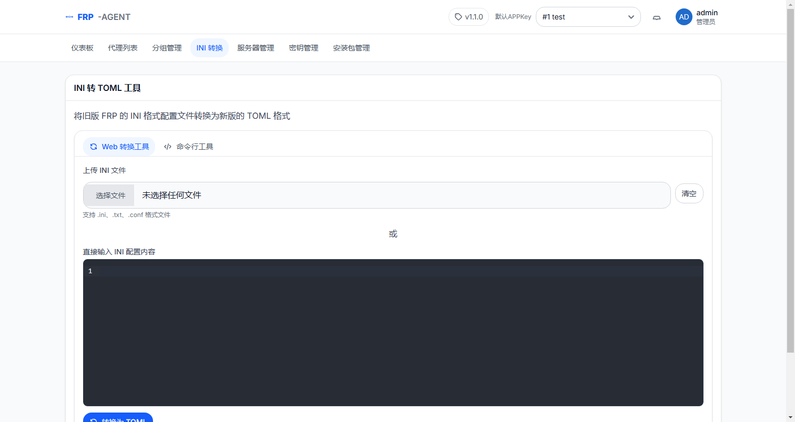

# frp-agent

> 轻量级 frp 代理可视化管理平台

frp-agent 是一个基于 Web 的 frp（Fast Reverse Proxy）客户端配置管理平台，提供代理全生命周期管理能力——从服务器接入、代理创建、配置生成到一键部署脚本，帮助团队高效管理大规模 frp 内网穿透服务。







## 功能概览

### 核心能力

- **多服务器统一管理** — 接入多个 frps 服务端，统一查看状态，支持连接测试
- **代理实时同步** — 定时从 frps API 拉取代理状态（默认 30 分钟），自动发现新代理、更新在线/离线状态
- **代理全量管理** — 创建、编辑、删除代理配置，支持按服务器 / 分组 / 状态 / 关键词筛选和批量操作
- **端口自动管理** — 智能分配端口，冲突检测与自动递增，支持端口范围管理
- **端口自动识别** — 从代理名称中的关键字（ssh、http、mysql、redis 等 40+ 种协议）自动识别本地服务端口

### 配置与部署

- **配置文件生成** — 按分组或自定义代理列表生成标准 frpc 配置文件，支持 INI 和 TOML 两种格式
- **配置文件导入** — 支持上传或粘贴 INI / TOML 配置文件，自动解析并创建代理记录
- **INI / TOML 格式互转** — 方便旧版配置向新版迁移
- **一键安装脚本** — 为分组生成交付脚本（Linux Bash / Windows PowerShell），自动下载 frpc 二进制 + 拉取配置文件
- **systemd 服务文件生成** — 一键生成 Linux systemd 服务单元文件

### 安装包管理

- **GitHub 自动同步** — 从 fatedier/frp 仓库同步各平台安装包，支持按版本 / 平台筛选
- **手动上传** — 支持上传自定义编译的 frpc 二进制文件
- **脚本模板自定义** — 可自定义各平台（Linux / Windows）的安装、升级脚本模板

### 系统管理

- **认证系统** — 支持 Basic Auth（数据库用户）+ API Key（Bearer Token / URL 参数），首次登录强制修改默认密码
- **主机资源管理** — SSH 主机与 Portainer Docker 环境独立纳管，支持用户/API Key 授权、远程操作和访问审计（[使用说明](docs/host-management.md)）
- **分组管理** — 从代理名称自动解析分组前缀（如 `dlyy_ssh` → `dlyy`），支持手动调整、批量端口重分配、一键安装
- **数据对比分析** — 对比 frps 实际代理与本地数据库记录，识别差异
- **代理历史记录** — 记录代理状态变更历史，便于问题追溯
- **版本检查** — 通过 Gitee Release API 自动检查更新

## 技术栈

| 层级 | 技术 |
|------|------|
| 前端 | Vue 3.4 + Vite 5 + Pinia + Tailwind CSS 4 + Flowbite + CodeMirror 6 |
| 后端 | Python 3.11 + FastAPI + SQLAlchemy + SQLite + APScheduler + httpx |
| 部署 | Docker 多阶段构建（Node 20 + Python 3.11） |

## 部署方式

### Docker 一键启动（推荐）

```bash
docker run -d \
  --name frp-agent \
  -p 8000:8000 \
  -v $(pwd)/data:/app/data \
  registry.cn-shanghai.aliyuncs.com/numen/frp-agent:latest
```

启动后访问 `http://localhost:8000` 进入管理界面。

### Docker Compose

```bash
git clone <repository-url> && cd frp-agent
mkdir -p data
docker compose up -d
```

## 环境变量

| 变量 | 默认值 | 说明 |
|------|--------|------|
| `APP_HOST` | `0.0.0.0` | 监听地址 |
| `APP_PORT` | `8000` | 监听端口 |
| `APP_DEBUG` | `false` | 调试模式 |
| `AUTH_USERNAME` | `admin` | 默认用户名 |
| `AUTH_PASSWORD` | `admin` | 默认密码 |
| `DATABASE_URL` | `sqlite:///./data/frp_agent.db` | 数据库连接 |
| `SYNC_INTERVAL_SECONDS` | `1800` | 代理同步间隔（秒） |
| `PACKAGES_DIR` | `data/packages` | 安装包存储目录 |
| `SSH_CREDENTIAL_SECRET` | 空 | SSH 与 Portainer 凭据加密密钥；生产环境必须设置并保持不变 |
| `SSH_GATEWAY_ENABLED` | `true` | 是否启用原生 SSH 跳板端口 |
| `SSH_GATEWAY_PORT` | `2222` | 原生 SSH 跳板监听端口 |
| `DOCKER_GATEWAY_ENABLED` | `true` | 是否启用 Docker Engine API 兼容 HTTPS 网关 |
| `DOCKER_GATEWAY_PORT` | `23750` | Docker HTTPS 网关监听端口 |
| `DOCKER_GATEWAY_TLS_COMMON_NAME` | `localhost` | Docker 网关自动生成 TLS 证书时使用的访问域名或 IP |

## 默认账号

- **用户名**：`admin`
- **密码**：`admin`

首次登录后系统会提示修改密码。

## 许可证

MIT License
