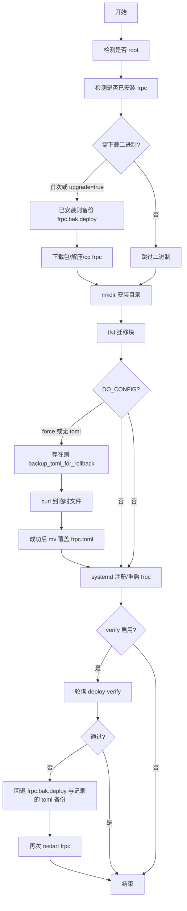

# 分组一键部署脚本（Linux）说明

本文说明由 `GET /api/groups/{group_name}/deploy` 返回的现场执行脚本（模板：[backend/app/script_templates/group_deploy_linux.sh](../backend/app/script_templates/group_deploy_linux.sh)）的行为逻辑，便于运维理解与排障。

## API 与调用方式

- **路径**：`GET /api/groups/{group_name}/deploy`
- **常用查询参数**
  - `server_name`（必填）：frps 在平台上的名称
  - `api_key`：鉴权（也可通过 Header 传递）
  - `install_path`：默认 `/opt/frp`
  - `platform`：默认 `linux_amd64`
  - `upgrade`：`true` 时在**已安装 frpc** 的前提下仍下载并替换二进制
  - `force_config`：`true` 时从平台**重新拉取** `frpc.toml`（覆盖本地，覆盖前先备份）
  - `verify`：默认 `true`；设为 `false` 时**不**在脚本中生成「部署后轮询 frp-agent + 失败回退」逻辑（适用于目标机无法访问 frp-agent、或未装 `python3`）
  - `min_online`：校验时至少多少条代理为 `online` 视为通过（默认 `1`）
  - `verify_attempts`：校验最大轮询次数（默认 `18`）
  - `verify_interval`：轮询间隔秒数（默认 `5`）

示例：

```bash
curl -sL "https://<frp-agent>/api/groups/<分组>/deploy?server_name=<服务器名>&api_key=<密钥>" | sudo bash
curl -sL "...&upgrade=true&force_config=true" | sudo bash
curl -sL "...&verify=false" | sudo bash
```

兼容旧端点：`/quick-install`、`/quick-download` 行为不变，与本文所述「统一部署」可并存。

## 部署后校验 API：`GET /api/groups/{group_name}/deploy-verify`

- **作用**：先对该 `server_name` 对应的 frps **执行一次同步**（与定时任务同源逻辑），再统计**该服务器上、该分组**的代理 `online` / `total`。
- **参数**：`server_name`（必填）、`min_online`（默认 `1`）、`api_key`（与其它接口相同，支持 URL 查询参数）。
- **返回 JSON**（示例）：`{"online": 5, "total": 7, "min_online": 1, "ok": true, "sync_ok": true, ...}`  
  - `ok`：`total > 0` 且 `online >= min_online` 时为 `true`；`total == 0` 时为 `false`（避免空分组误判成功）。
  - **frps 同步失败**：HTTP **503**，现场 `curl -f` 会失败，脚本将视为校验不通过。
- **注意**：必须用 `server_name` 限定 frps，避免同名分组在不同服务器上混淆。

## 执行顺序概览



## 二进制（frpc）

| 条件 | 行为 |
|------|------|
| 未检测到 `$install_path/frpc` | 下载并安装（不生成 `frpc.bak.deploy`） |
| 已安装且 `upgrade=true` | 停止服务后先 **备份** `frpc` → `frpc.bak.deploy`，再下载替换 |
| 已安装且 `upgrade=false` | 跳过二进制下载 |

## INI 迁移（必须在拉取 `frpc.toml` 之前）

避免「先有平台生成的 toml，再把旧 ini 挪成备份」导致旧配置从未作为运行配置生效。

| 现场文件 | 行为 |
|----------|------|
| 仅有 `frpc.ini`，无 `frpc.toml` | 先**备份** `frpc.ini`（`*.backup_时间戳`），再将 `frpc.ini` **重命名**为 `frpc.toml` |
| `frpc.toml` 与 `frpc.ini` 并存 | 日志说明**不合并**内容；先备份 ini，再将 ini 移名为 `frpc.ini.backup_时间戳`，**保留现有 toml** |

## 是否从平台拉取配置（`DO_CONFIG`）

在 **INI 迁移完成之后** 根据磁盘上是否已有 `frpc.toml` 判断：

| 条件 | `DO_CONFIG` |
|------|-------------|
| `force_config=true` | 是（覆盖拉取） |
| 不存在 `frpc.toml` | 是（必须拉取） |
| 已有 `frpc.toml` 且未 `force_config` | 否（保留本地，含刚由 ini 迁过来的 toml） |

说明：平台上新增远程端口、代理等后，若现场要**同步成平台最新配置**，需使用 **`force_config=true`**（或前端勾选「覆盖配置文件」）。

## 覆盖 `frpc.toml` 时的安全写入

当 `DO_CONFIG=true`：

1. 若 `frpc.toml` **已存在**：先 `cp` 为 `frpc.toml.backup_时间戳`，并记录路径供校验失败时回退。
2. `curl -fsSL` 写入 `frpc.toml.tmp.<pid>`；失败则删除临时文件并退出非零。
3. 成功则 `mv` 覆盖正式 `frpc.toml`，减少半截文件风险。

## systemd 与重启

- **root** 且存在 `systemctl`：可写 `/etc/systemd/system/frpc.service`（若不存在则创建并 `enable`），最后执行 **`systemctl restart frpc`**（失败则 `start`）。
- **非 root**：不注册 systemd，仅提示用 `$FRPC_BIN -c $CONFIG_FILE` **手动**运行；**不会自动重启**服务。

因此：**覆盖配置后若要 frpc 立即加载新端口/代理，需用 root + sudo 执行管道**，否则会停在「文件已更新但进程未重启」。

## 部署后校验与自动回退（`verify=true` 且已安装 python3）

- 脚本在 **restart 之后**，按 `verify_attempts` / `verify_interval` 轮询内嵌的 `VERIFY_URL`（即带 `api_key` 的 `deploy-verify`）。
- 使用 **`python3`** 解析 JSON，要求 `sync_ok` 与 `ok` 均为真；若始终失败：
  - **root + systemd**：`stop` → 若存在则 **`cp frpc.bak.deploy` 还原二进制** → 若记录过则 **还原本次覆盖前的 `frpc.toml` 备份** → 再次 `restart`。
  - **非 root**：仅打印说明，需人工从 `frpc.bak.deploy` 与 `*.backup_*` 恢复。

**限制与风险**：

- 目标机必须能访问 **frp-agent**（与拉配置、拉包同一可达性）；内网隔离请使用 `verify=false`。
- **首次安装**且尚未有任何在线代理时，`deploy-verify` 可能长期 `ok: false`，易触发回退；可按场景关闭校验或调大 `min_online` / 接受首次不校验。
- `min_online=1` 只保证「至少一条隧道在线」；若要「全部在线」可提高 `min_online`。
- **frps 同步失败（503）** 与「代理全离线」在脚本侧均视为校验失败，可能触发回退；回退后若 frps/网络仍异常，需带外排查。

## 与「人工验证」的关系

即使开启自动校验，仍建议必要时查看：

- `systemctl status frpc` / `journalctl -u frpc -e`
- frps Dashboard / frp-agent 界面中的代理状态
- 实际业务端口连通性

## 参数组合速查

| 场景 | `upgrade` | `force_config` | `verify` | 预期 |
|------|-----------|------------------|----------|------|
| 首次安装 | 任意 | 否 | 默认 true | 装二进制 + 拉配置 + systemd + 校验（可能需关 verify） |
| 只升版本不改配置 | true | 否 | 默认 true | 备份二进制后替换；校验失败可回退二进制 |
| 平台改了端口/代理，要同步配置 | 否/均可 | true | 默认 true | 备份 toml 后拉新配置；失败可回退 toml |
| 目标机不能访问 agent | 任意 | 任意 | **false** | 跳过轮询与自动回退 |

## 相关代码位置

- Shell 模板：`backend/app/script_templates/group_deploy_linux.sh`
- 生成脚本与路由：`backend/app/routers/group.py`（`_build_deploy_script`、`group_deploy`、`deploy_verify`）
- 定时同步复用：`app.scheduler.sync_server`
- 前端一键部署对话框：`frontend/src/components/GroupManage.vue`（`getDeployScriptUrl` 见 `frontend/src/api/groups.js`）
