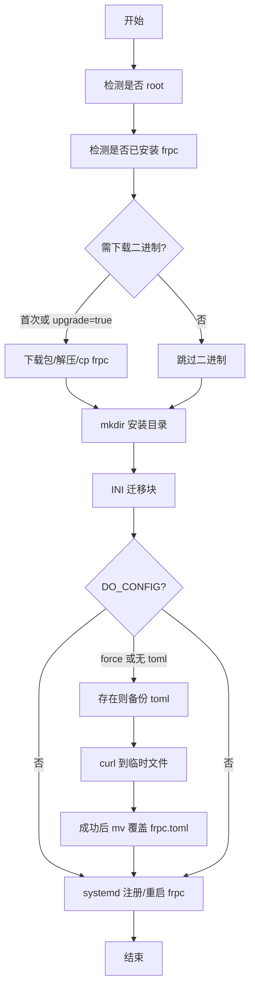

# 分组一键部署脚本（Linux）说明

本文说明由 `GET /api/groups/{group_name}/deploy` 返回的现场执行脚本（模板：[backend/app/script_templates/group_deploy_linux.sh](../backend/app/script_templates/group_deploy_linux.sh)）的行为逻辑，便于运维理解与排障。

## API 与调用方式

- **路径**：`GET /api/groups/{group_name}/deploy`
- **常用查询参数**
  - `server_name`（必填）：frps 在平台上的名称
  - `api_key`：鉴权（也可通过 Header 传递）
  - `install_path`：默认 `/opt/frp`
  - `platform`：默认 `linux_amd64`
  - `upgrade`：`true` 时在**已安装 frpc** 的前提下仍下载并替换二进制
  - `force_config`：`true` 时从平台**重新拉取** `frpc.toml`（覆盖本地，覆盖前先备份）

示例：

```bash
curl -sL "https://<frp-agent>/api/groups/<分组>/deploy?server_name=<服务器名>&api_key=<密钥>" | sudo bash
curl -sL "...&upgrade=true&force_config=true" | sudo bash
```

兼容旧端点：`/quick-install`、`/quick-download` 行为不变，与本文所述「统一部署」可并存。

## 执行顺序概览



## 二进制（frpc）

| 条件 | 行为 |
|------|------|
| 未检测到 `$install_path/frpc` | 下载并安装 |
| 已安装且 `upgrade=true` | 先尝试 `systemctl stop frpc`（root 且服务在跑），再下载替换 |
| 已安装且 `upgrade=false` | 跳过二进制下载 |

## INI 迁移（必须在拉取 `frpc.toml` 之前）

避免「先有平台生成的 toml，再把旧 ini 挪成备份」导致旧配置从未作为运行配置生效。

| 现场文件 | 行为 |
|----------|------|
| 仅有 `frpc.ini`，无 `frpc.toml` | 先**备份** `frpc.ini`（`*.backup_时间戳`），再将 `frpc.ini` **重命名**为 `frpc.toml` |
| `frpc.toml` 与 `frpc.ini` 并存 | 日志说明**不合并**内容；先备份 ini，再将 ini 移名为 `frpc.ini.backup_时间戳`，**保留现有 toml** |

## 是否从平台拉取配置（`DO_CONFIG`）

在 **INI 迁移完成之后** 根据磁盘上是否已有 `frpc.toml` 判断：

| 条件 | `DO_CONFIG` |
|------|-------------|
| `force_config=true` | 是（覆盖拉取） |
| 不存在 `frpc.toml` | 是（必须拉取） |
| 已有 `frpc.toml` 且未 `force_config` | 否（保留本地，含刚由 ini 迁过来的 toml） |

说明：平台上新增远程端口、代理等后，若现场要**同步成平台最新配置**，需使用 **`force_config=true`**（或前端勾选「覆盖配置文件」）。

## 覆盖 `frpc.toml` 时的安全写入

当 `DO_CONFIG=true`：

1. 若 `frpc.toml` **已存在**：先 `cp` 为 `frpc.toml.backup_时间戳`。
2. `curl -fsSL` 写入 `frpc.toml.tmp.<pid>`；失败则删除临时文件并退出非零。
3. 成功则 `mv` 覆盖正式 `frpc.toml`，减少半截文件风险。

## systemd 与重启

- **root** 且存在 `systemctl`：可写 `/etc/systemd/system/frpc.service`（若不存在则创建并 `enable`），最后执行 **`systemctl restart frpc`**（失败则 `start`）。
- **非 root**：不注册 systemd，仅提示用 `$FRPC_BIN -c $CONFIG_FILE` **手动**运行；**不会自动重启**服务。

因此：**覆盖配置后若要 frpc 立即加载新端口/代理，需用 root + sudo 执行管道**，否则会停在「文件已更新但进程未重启」。

## 与「重启、验证」的关系

- **重启**：脚本在 systemd 分支**每次都会** `restart`（不仅限于改了配置），用于保证二进制或配置变更后进程使用最新文件。
- **验证**：脚本**不包含**业务层健康检查（不探测端口、不请求 frps、不执行 `frpc verify`）。重启后请自行：
  - `systemctl status frpc` / `journalctl -u frpc -e`
  - frps 控制台查看代理在线情况
  - 按实际业务做连通性测试

## 参数组合速查

| 场景 | `upgrade` | `force_config` | 预期 |
|------|-----------|----------------|------|
| 首次安装 | 任意 | 否 | 装二进制 + 拉配置 + systemd |
| 只升版本不改配置 | true | 否 | 替换 frpc；保留原 toml |
| 平台改了端口/代理，要同步配置 | 否/均可 | true | 备份旧 toml + 拉新配置 + restart |
| 仅本地 ini 迁 toml、不要平台覆盖 | 否 | 否 | 迁移后若有 toml 则**不**拉取 |

## 相关代码位置

- Shell 模板：`backend/app/script_templates/group_deploy_linux.sh`
- 生成脚本与路由：`backend/app/routers/group.py`（`_build_deploy_script`、`group_deploy`）
- 前端一键部署对话框：`frontend/src/components/GroupManage.vue`（`getDeployScriptUrl` 见 `frontend/src/api/groups.js`）
